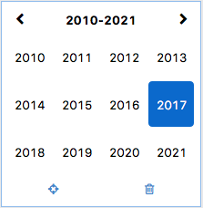

# xcalendar  
swt calendar widget  

# 1. Install  
## 1.1. Requirements  
jdk 1.8+  
maven-3.2.3+  
swt 4.2.1+  

## 1.2. Install from source code  

``` 
    #windows
    $mvn clean install -Pwin_x86_64 -Dmaven.test.skip=true
    
    #mac
    $mvn clean install -Pmac_x86_64 -Dmaven.test.skip=true
```  

# 2. Simple usage  
## 2.1. Select date  

```java  
XCalendar x = new XCalendar(text.getParent(), SWT.DATE);
x.setup(v -> true, true);
x.show(text.getParent(), text.getBounds());
```

  

## 2.2. Select time  

```java  
XCalendar x = new XCalendar(text.getParent(), SWT.TIME);
x.setup(v -> true, true);
x.show(text.getParent(), text.getBounds());
```

  

## 2.3. Select year  

```java  
XCalendar x = new XCalendar(text.getParent(), SWT.SHORT);
x.setup(v -> true, true);
x.show(text.getParent(), text.getBounds());
```

  

## 2.4. Select year month

```java  
XCalendar x = new XCalendar(text.getParent(), SWT.MEDIUM);
x.setup(v -> true, true);
x.show(text.getParent(), text.getBounds());
```

  

## 2.5. Filters

```java  
x.setup(v -> v.before(new Date()), true);
```

  

## 2.6. XCalendarSelectEvent

```java  
XCalendar x = new XCalendar(text.getParent(), SWT.MEDIUM);
x.setup(v -> true, true);
x.addXCalendarEventListener(new XCalendarEventListener() {
    @Override
    public void onEvent(XCalendarEvent event) {
        if (!(event instanceof XCalendarSelectEvent)) return;
        XCalendarSelectEvent s = (XCalendarSelectEvent) event;
        //your code gots here.            
    }
});
x.show(text.getParent(), text.getBounds());
```