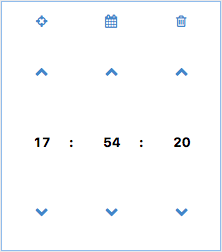
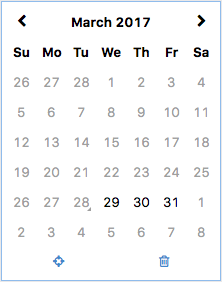

Table of Contents
=================

   * [1. Install](#1-install)
      * [1.1. Brief introduction](#11-brief-introduction)
      * [1.2. Requirements](#12-requirements)
      * [1.3. Install from source code](#13-install-from-source-code)
   * [2. Simple usage](#2-simple-usage)
      * [2.1. Select date](#21-select-date)
      * [2.2. Select date time](#22-select-date-time)
      * [2.3. Select year](#23-select-year)
      * [2.4. Select year month](#24-select-year-month)
      * [2.5. Select time](#25-select-time)
      * [2.6. Filters](#26-filters)
      * [2.7. XCalendarSelectEvent](#27-xcalendarselectevent)


# 1. Install  
## 1.1. Brief introduction  
swt calendar widget  

## 1.2. Requirements  
jdk 1.8+  
maven-3.2.3+  
swt 4.2.1+  

## 1.3. Install from source code  

``` 
    #windows
    $mvn clean install -Pwin_x86_64 -Dmaven.test.skip=true
    
    #mac
    $mvn clean install -Pmac_x86_64 -Dmaven.test.skip=true
    
    #linux
    $mvn clean install -Plinux_x86_64 -Dmaven.test.skip=true
```  

# 2. Simple usage  
## 2.1. Select date  

```java  
XCalendar x = new XCalendar(text.getParent(), SWT.DATE);
x.setup(v -> true, true);
x.show(text.getParent(), text.getBounds());
```

  

## 2.2. Select date time  

```java  
XCalendar x = new XCalendar(text.getParent(), SWT.LONG);
x.setup(v -> true, true);
x.show(text.getParent(), text.getBounds());
```

  

## 2.3. Select year  

```java  
XCalendar x = new XCalendar(text.getParent(), SWT.SHORT);
x.setup(v -> true, true);
x.show(text.getParent(), text.getBounds());
```

  

## 2.4. Select year month

```java  
XCalendar x = new XCalendar(text.getParent(), SWT.MEDIUM);
x.setup(v -> true, true);
x.show(text.getParent(), text.getBounds());
```

  

## 2.5. Select time  

```java  
XCalendar x = new XCalendar(text.getParent(), SWT.TIME);
x.setup(v -> true, true);
x.show(text.getParent(), text.getBounds());
```

  

## 2.6. Filters

```java  
x.setup(v -> v.after(new Date()), true);
```

  

## 2.7. XCalendarSelectEvent

```java  
XCalendar x = new XCalendar(text.getParent(), SWT.MEDIUM);
x.setup(v -> true, true);
x.addXCalendarEventListener(new XCalendarEventListener() {
    @Override
    public void onEvent(XCalendarEvent event) {
        if (!(event instanceof XCalendarSelectEvent)) return;
        XCalendarSelectEvent s = (XCalendarSelectEvent) event;
        // your code goes here.            
    }
});
x.show(text.getParent(), text.getBounds());
```